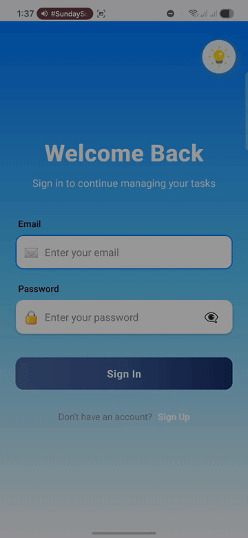
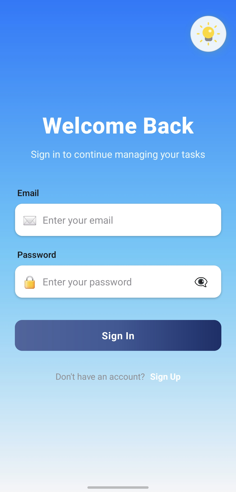
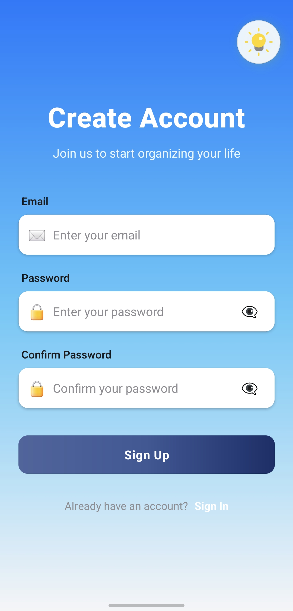
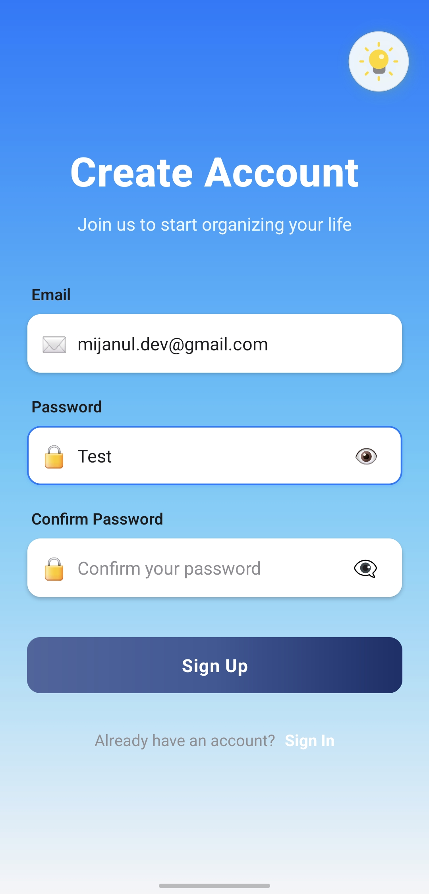
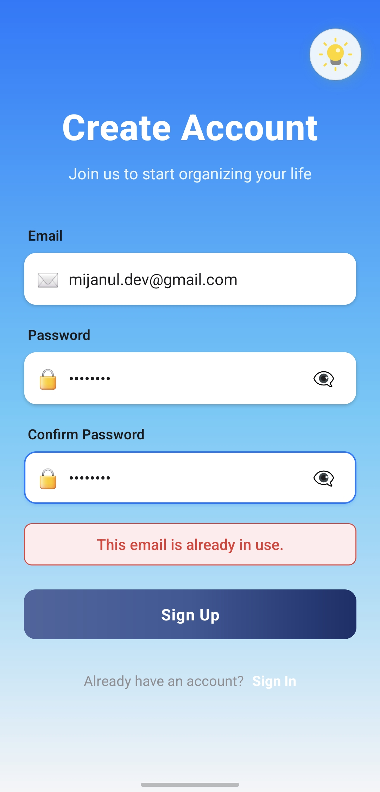
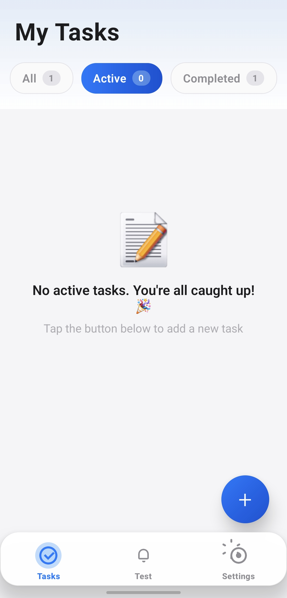
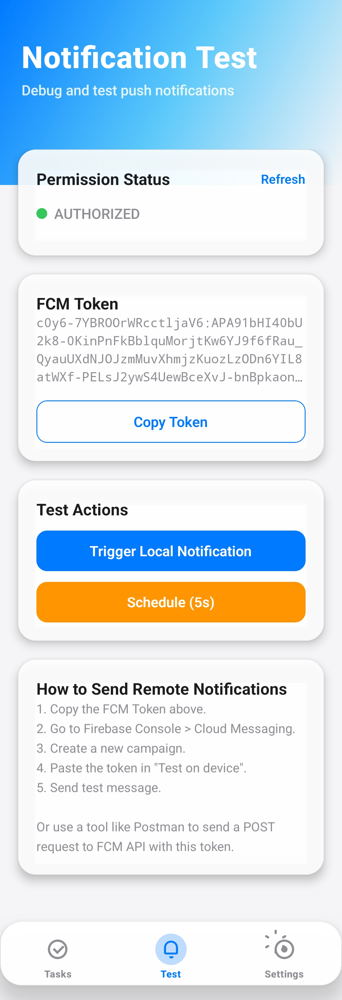
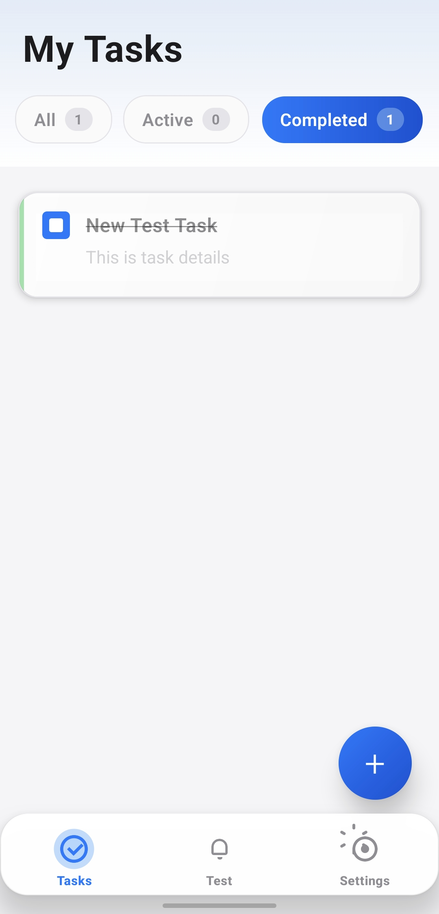

# Todo App - Offline-First React Native

> A production-ready task management app built with React Native, featuring offline-first architecture, Firebase sync, and push notifications.

## 📥 Download Latest Release APK

[](https://github.com/yourusername/todo/releases/latest/download/app-release.apk)

## 📚 Interview Preparation

**[📱 130 Project-Specific Interview Questions](./PROJECT_INTERVIEW_QUESTIONS.md)** - Complete technical interview prep covering architecture, state management, offline-first design, Firebase integration, performance optimization, and more. Each question includes detailed answers, real code examples, and explanations.

## 📱 App Preview

### Demo Videos

<p align="center">
  
  
</p>

### Screenshots

<table>
  <tr>
    <td></td>
    <td></td>
    <td></td>
  </tr>
  <tr>
    <td></td>
    <td></td>
    <td></td>
  </tr>
  <tr>
    <td></td>
  </tr>
</table>

## ✨ Features

### 1. 🔐 Authentication

**Sign Up & Login** using Firebase Authentication with email/password credentials.

- ✅ Email/password authentication
- ✅ Persistent user sessions across app restarts
- ✅ Secure authentication state management with Redux
- ✅ Automatic session restoration on app launch

---

### 2. 📝 Task Management

Complete CRUD operations for tasks with real-time updates.

**Features:**

- ✅ **Add tasks** with title, description, and reminder time
- ✅ **Edit tasks** with validation for past/future dates
- ✅ **Delete tasks** with soft-delete mechanism
- ✅ **Mark tasks as complete/incomplete** with visual feedback
- ✅ **Filter tasks** by status (All, Active, Completed)
- ✅ **Local storage** with Realm database
- ✅ **Cloud sync** to Firestore when online

---

### 3. 🔄 Offline Support

**Offline-first architecture** using Realm database with automatic cloud synchronization.

**Key Features:**

- ✅ **Local database** using Realm for offline storage
- ✅ **Automatic sync** when connectivity is restored
- ✅ **Conflict resolution** with timestamp-based merging
- ✅ **Sync status indicators** (idle, syncing, succeeded, failed)
- ✅ **Unsynced changes tracking** for reliable data integrity
- ✅ **Background sync** with real-time listeners

**Sync Flow:**

1. Changes made offline are stored locally in Realm
2. Network connectivity is monitored continuously
3. When online, unsynced tasks are pushed to Firestore
4. Remote changes are pulled and merged with local data
5. Visual sync status displayed in the UI

---

### 4. 🔔 Push Notifications

**Local and remote push notifications** using Notifee and Firebase Cloud Messaging.

**Features:**

- ✅ **Local push notifications** for task reminders
- ✅ **Firebase Cloud Messaging** integration for remote notifications
- ✅ **Scheduled notifications** with exact timing
- ✅ **Notification channels** for Android with custom importance levels
- ✅ **Permission management** for iOS and Android
- ✅ **FCM token management** for targeted messaging
- ✅ **Background & foreground** notification handling

---

### 5. 🌍 Multi-Environment Configuration

Support for **development, staging, and production** environments.

**Environment Files:**

- `.env.development` - Development configuration
- `.env.staging` - Staging configuration
- `.env.production` - Production configuration

**Run Commands:**

- Development: `npm run android:dev` / `npm run ios:dev`
- Staging: `npm run android:staging` / `npm run ios:staging`
- Production: `npm run android:prod` / `npm run ios:prod`

Each environment can have separate Firebase projects, API endpoints, and feature flags.

---

### 6. 🎨 Theming

**Dynamic light/dark mode** with comprehensive theme system.

**Features:**

- ✅ **Light & dark mode** with smooth transitions
- ✅ **Theme toggle** with floating action button
- ✅ **Persistent theme preference** across sessions
- ✅ **Gradient backgrounds** adapting to theme
- ✅ **Comprehensive design tokens** (colors, spacing, typography, shadows)
- ✅ **Animated theme transitions** for enhanced UX

---

### 7. 📊 State Management

**Redux Toolkit** for centralized, predictable state management.

**Redux Slices:**

- `authSlice` - User authentication state
- `taskSlice` - Task data and operations
- `syncSlice` - Synchronization status
- `themeSlice` - Theme preferences

**Benefits:**

- ✅ Type-safe state management with TypeScript
- ✅ Immutable state updates
- ✅ DevTools integration for debugging
- ✅ Middleware support for async operations

---

### 8. 🧭 Navigation

**React Navigation 7.x** with proper stack structure.

**Navigation Stacks:**

- **Auth Stack** - Login, Sign Up screens
- **App Stack** - Main application screens
- **Tab Navigator** - Tasks, Settings, Notifications tabs

**Features:**

- ✅ **Conditional navigation** based on auth state
- ✅ **Type-safe navigation** with TypeScript
- ✅ **Deep linking** support
- ✅ **Lazy loading** of screens for performance
- ✅ **Smooth transitions** and animations

---

### 9. ⚡ Performance Optimizations

**Production-ready optimizations** for smooth user experience.

#### FlatList Optimizations

- ✅ **Virtualization** with optimized rendering
- ✅ **Item layout calculation** for smooth scrolling
- ✅ **Batch rendering** for better performance
- ✅ **Clipped subviews removal** to reduce memory usage

#### Code Optimizations

- ✅ **Memoized components** using React.memo
- ✅ **Lazy loading** of screens and components
- ✅ **Debounced search** and filtering
- ✅ **Optimized re-renders** with useCallback and useMemo
- ✅ **Image optimization** and caching
- ✅ **Bundle size optimization** with code splitting

---

### Additional Features

- 🔔 **Network Status Indicator** - Real-time connectivity monitoring
- 🎯 **Pull-to-refresh** - Manual sync trigger
- 🔍 **Task filtering** - By completion status
- 📱 **Responsive UI** - Adapts to different screen sizes
- 🎭 **Animated interactions** - Smooth micro-animations
- 🛡️ **Error handling** - Comprehensive error boundaries
- 📝 **TypeScript** - Full type safety across the codebase

## Tech Stack

- **Framework**: React Native 0.82.1
- **Language**: TypeScript
- **State Management**: Redux Toolkit
- **Navigation**: React Navigation 7.x
- **Local Database**: Realm
- **Backend**: Firebase (Auth, Firestore, Messaging)
- **Notifications**: Notifee + Firebase Cloud Messaging
- **UI Components**: Custom themed components with Linear Gradient support

## Prerequisites

- Node.js (v14 or higher)
- npm or yarn
- React Native CLI
- Xcode (for iOS development)
- Android Studio (for Android development)
- CocoaPods (for iOS)

## Installation

1. Clone the repository:

```bash
git clone <repository-url>
cd todo
```

2. Install dependencies:

```bash
npm install
```

3. Install iOS pods:

```bash
cd ios
pod install
cd ..
```

4. **Android Configuration:**

   **Configure Android SDK Path:**

   The `android/local.properties` file contains the path to your Android SDK. You have two options:

   - **Option 1 (Recommended)**: If you have Android SDK configured globally, delete the `local.properties` file:

     ```bash
     rm android/local.properties
     ```

   - **Option 2**: Update the SDK path in `android/local.properties` to match your local setup:
     ```properties
     sdk.dir=/Users/YOUR_USERNAME/Library/Android/sdk
     ```

   **Install NDK (Side by Side):**

   React Native requires NDK for native code compilation. Install it via Android Studio:

   1. Open Android Studio
   2. Go to **Settings/Preferences** → **Appearance & Behavior** → **System Settings** → **Android SDK**
   3. Click on the **SDK Tools** tab
   4. Check **NDK (Side by side)**
   5. Click **Apply** to install

   **Recommended Android Build Versions:**

   This project uses the following Android SDK versions (configured in `android/build.gradle`):

   ```gradle
   buildToolsVersion = "36.0.0"
   minSdkVersion = 24
   compileSdkVersion = 36
   targetSdkVersion = 36
   ndkVersion = "27.1.12297006"
   ```

5. Set up environment files:
   Create the following files in the root directory:

- `.env.development`
- `.env.staging`
- `.env.production`

## Running the App

### Development

**Android:**

```bash
npm run android:dev
```

**iOS:**

```bash
npm run ios:dev
```

### Staging

**Android:**

```bash
npm run android:staging
```

**iOS:**

```bash
npm run ios:staging
```

### Production

**Android:**

```bash
npm run android:prod
```

**iOS:**

```bash
npm run ios:prod
```

### Metro Bundler

Start the Metro bundler separately:

```bash
npm start
# or for specific environment
npm run start:dev
npm run start:staging
npm run start:prod
```

## Building Release APK

To build a release APK for Android:

```bash
cd android
./gradlew assembleRelease
cd ..
```

The generated APK will be available at:
`android/app/build/outputs/apk/release/app-release.apk`

You can install it directly on your Android device or distribute it for testing.

## Project Structure

```
src/
├── components/       # Reusable UI components
│   ├── atoms/       # Basic building blocks
│   ├── molecules/   # Composite components
│   └── organisms/   # Complex components
├── features/        # Feature-based modules
│   ├── auth/        # Authentication
│   ├── notifications/ # Push notifications
│   ├── settings/    # App settings
│   └── tasks/       # Task management
├── hooks/           # Custom React hooks
├── navigation/      # Navigation configuration
├── services/        # External services
│   ├── database/    # Realm database
│   ├── firebase/    # Firebase integration
│   ├── notifications/ # Notification handling
│   └── sync/        # Sync logic
├── store/           # Redux store
│   └── slices/      # Redux slices
├── theme/           # Theme configuration
├── types/           # TypeScript types
└── utils/           # Utility functions
```

## Firebase Setup

1. Create a Firebase project at [Firebase Console](https://console.firebase.google.com/)
2. Add iOS and Android apps to your Firebase project
3. Download configuration files:
   - `google-services.json` for Android → Place in `android/app/`
   - `GoogleService-Info.plist` for iOS → Place in `ios/todo/`
4. Enable Authentication and Firestore in Firebase Console
5. Set up Firebase Cloud Messaging for push notifications

## Environment Variables

Configure the following variables in your `.env` files:

```
# Add your environment-specific variables here
FIREBASE_API_KEY=
FIREBASE_AUTH_DOMAIN=
FIREBASE_PROJECT_ID=
# ... other Firebase config
```

## Contributing

1. Fork the repository
2. Create your feature branch (`git checkout -b feature/amazing-feature`)
3. Commit your changes (`git commit -m 'Add some amazing feature'`)
4. Push to the branch (`git push origin feature/amazing-feature`)
5. Open a Pull Request

## ⚠️ Known Limitations

There are some bugs to be fixed in future releases:

1. **Notification Persistence After Logout** - Scheduled notifications continue to trigger even after user logout
2. **UI Sync Delay** - Task list page requires manual pull-to-refresh to update UI even when all tasks are synced
3. **Offline Button States** - Some buttons remain enabled while offline and should be disabled
4. **Fixed Font & Styles** - Font sizes and styles are not responsive to different screen sizes
5. **Minor Bugs** - Various other minor bugs and edge cases to be addressed

## 📚 Additional Information

### ■ Architecture Choice

This project follows an **offline-first architecture** with the following design decisions:

- **Local-first approach**: Realm database as the primary data source
- **Feature-based folder structure**: Organized by features (auth, tasks, settings, notifications)
- **Atomic design pattern**: Components organized as atoms, molecules, and organisms
- **Separation of concerns**: Clear separation between UI, business logic, and data layers
- **Service layer pattern**: Dedicated services for Firebase, database, sync, and notifications

See the [Project Structure](#project-structure) section for detailed folder organization.

### ■ Libraries Used

**Core Technologies:**

- React Native 0.82.1
- TypeScript
- Redux Toolkit (State Management)
- React Navigation 7.x (Navigation)

**Database & Backend:**

- Realm (Local Database)
- Firebase Authentication
- Firebase Firestore
- Firebase Cloud Messaging

**UI & Styling:**

- React Native Linear Gradient
- Custom theme system with light/dark mode

**Notifications:**

- Notifee (Local notifications)
- @react-native-firebase/messaging (Remote notifications)

**Utilities:**

- @react-native-community/netinfo (Network monitoring)
- react-native-config (Environment configuration)

See the [Tech Stack](#tech-stack) section for complete details.

### ■ How to Run the App in Each Environment

**Development Environment:**

```bash
npm run android:dev  # Android
npm run ios:dev      # iOS
```

**Staging Environment:**

```bash
npm run android:staging  # Android
npm run ios:staging      # iOS
```

**Production Environment:**

```bash
npm run android:prod  # Android
npm run ios:prod      # iOS
```

Each environment uses its corresponding `.env` file (`.env.development`, `.env.staging`, `.env.production`).

See the [Running the App](#running-the-app) section for detailed setup instructions.

## License

This project is private and not licensed for public use.

## Support

For issues and questions, please create an issue in the repository.
